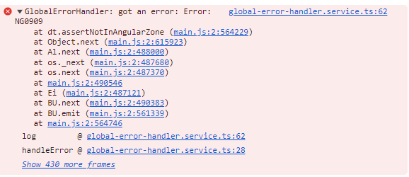

# AngularWebcomponentErrorTest

Dieses Projekt ist eine Demoanwendung um ein Problem mit lazy Loading von Webcompoents nachzustellen.

## Problembeschreibung

Benutzt eine Shell Anwendung eine Web Component, welche mit Angular 17 und ngx-build-plus Builder gebaut ist,
kommt es zu einem Laufzeitfehler, wenn die Angular Komponente, welche die WebComponent importiert lazy geloaded wird.

## Problemanalyse

Nach reichlicher Analyse ist festzustellen, das eine ganz gewisse Konstelation das Problem verursacht. Folgende Punkte müssen gegeben sein:

1. Die Webcomponent muss mit Angular Elements und ngx-build-plus gebaut werden
2. Die Trägeranwendung (Shell) benutzt Angular 15 und einen Custom Webpack Builder
3. Die Trägeranwenung benutzt eine Standalone Component welche die Webcomponent importiert
4. Die Standalone Component wird lazy geloaded

## Aktueller Stand

Aktuell ist festzuhalten, das es ein zusammenspiel von einer lazy geloadeden Webcomponent mit dem Angular Builder der Trägeranwendung besteht. Warum ausgerechnet hier ein Fehler im zone.js code der Web Component auftritt ist allerdings nicht klar